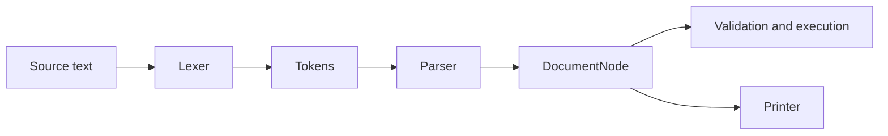

The language package is independent of schema construction. `Source` tracks the
query body and location data. The lexer emits GraphQL tokens; the recursive parser
builds nodes from `fastql.language.ast`.

Syntax errors carry source locations and stop execution before schema validation.
A parsed `DocumentNode` can be passed directly to `validate` or `execute`, avoiding
re-parsing for applications that cache documents.

The AST preserves executable definitions, fragments, directives, values, variables,
and type references. Schema definition language output is produced from the compiled
schema model rather than by round-tripping a user-provided SDL document.
