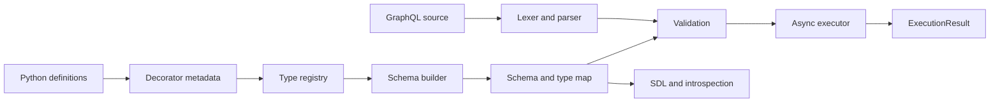

FastQL is organized as a staged pipeline with a shared internal schema model.

Decorators collect user intent without constructing a parallel execution schema.
The schema builder resolves Python annotations, names, fields, and abstract types
into `fastql.types`. Validation, execution, SDL, and introspection all consume that
compiled representation.

This separation keeps the public declaration API ergonomic while preserving clear
GraphQL language and runtime boundaries.
